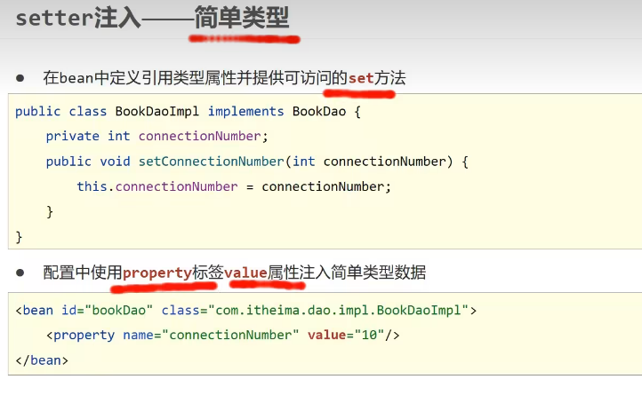

# SSM

## spring

 IOC;控制反转，不用主动new，创建控制权由程序转移到外部，为了解耦。

inversion of control

静态工厂

实例工厂

**较为常用**

nit-method destroy-method

必须关闭容器，才能正常调用destroy-method。

ctx.registerShutdownHook(); 注册关闭钩子。

ctx.close(); 粗暴，调用位置不同，效果不同。

implements InititalBean，disposeBean

afterPropertiesSet();

bean销毁时机

依赖注入

### setter 注入

### 构造器注入

consturctor-arg name ref 

直接使用，耦合度较高：

解决形参名字问题：

解决参数类型重复问题。使用位置进行参数匹配。

### 依赖自动装配

bean所依赖资源在容器中自动查找并注入到bean中的过程叫自动装配。

类型匹配必须唯一。按类型。

可以多个名字。按名称。

i