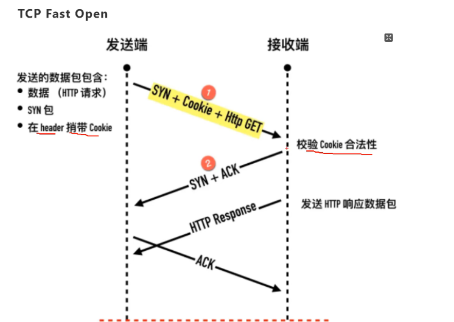
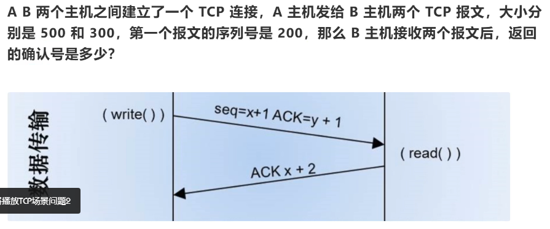

tcp网络分层

三次握手为什么三次

双方认同

为什么四次挥手？

为什么syn/fin需要序列号？

凡是需要对端确定的，一定消耗tcp报文的序列号。syn/fin需要对端的确定，所以需要消耗一个序列号。

半连接队列/什么是syn flood攻击？

TCP快速打开 TPO

在发送第一个SYN包的时候就开始传递数据，它要求当前客户端之前已经完成过正常的三次握手。

防止syn-flood攻击。

快速打开分两阶段：请求 fast open cookie 和 真正开始 TCP Fast Open。

TCP报文中时间戳有什么作用？

TCP的超时重传时间如何计算？（RTO: Retransmission TimeOut）

经典方法： 取平均值。

平滑往返时间 （smoothed round trip time）SRTT

TCP的流量控制？

tcp的keep-alive的原理？

tcp中的端口号：

port

最大允许65536个端口号。

确认号是1000。

模拟http

curl www.baidu.com 80

tcpdump -i any host 百度ip地址

## 网络组成

分组 分包

网络提供/网络接入

传输层协议tcp 为什么握手三次，挥手四次？

tcp协议向上——应用到应用的协议。

tcp——主机到主机（端口号确定应用）

 

网络层：地址到地址的通信，ip协议， 不负责信号在具体两设备间的传递。

可靠性（数据保证无损传输）

SYN(Synchroniation)

FIN(Finish)

PSH(PUSH)

tcp的拆包和粘包

延迟，吞吐量，丢包率

