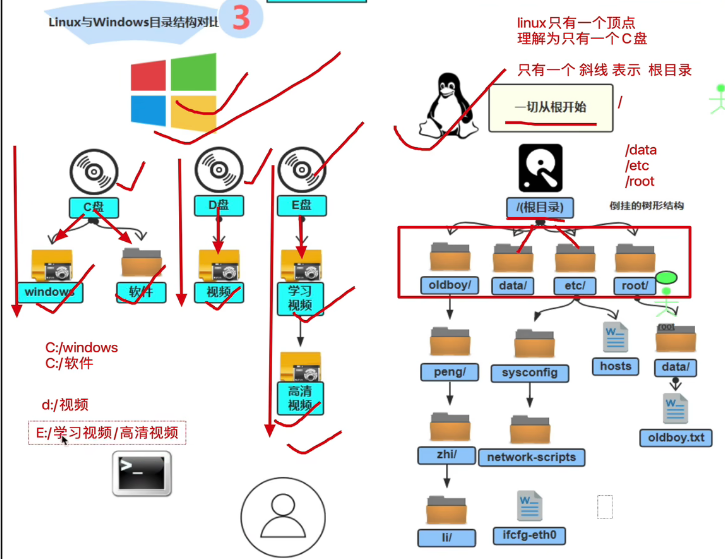
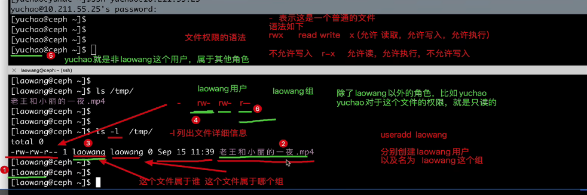

# 云计算分类

SAaS：基于云的应用，被授予的企业或个人通过网络访问使用，软件即服务

PAaS：云服务平台，提供硬件和软件工具，平台及服务

IAaS：基础设施即服务，提供按需付费的资源

公有云，私有云，混合云

rm:remove

ls:list

pwd:print word dir



linux文件权限查看

useradd 用户名： 创建用户

passwd 用户名： 更改密码

ssh 用户名@ip地址

rm -rf /* 删除资料所有东西  	-r 递归 -f 强制

mkdir 创建目录

ls -l 列出文件详细信息




move 可以修改文件名字

linux的文件编辑

```shell
vi 打开文件

输入i进入编辑模式

保存写入，推出vi文本编辑器
esc键/冒号/wq!

查看文本内容
cat 读取文件内容

更改权限
最大化权限
可读可写可执行
 
用户， 用户组， 其他人
4+2+1 最大权限就是7
chmod 777 文件
```

