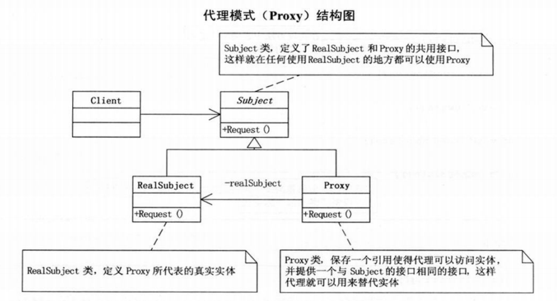

策略模式： 算法家族，分别封装， 互为替代，让算法变化，不会影响到使用算法的客户。

开放封闭原则：OCP 

当变化发生时， 创建抽象来隔离以后发生的同类变化。

依赖倒转原则：

高层模块不应该依赖于低层模块， 两个模块都应该依赖于抽象

抽象不应该依赖细节，细节应该依赖抽象。

里氏代换原则（LSP）： 子类必须能够完全替换掉它们的父类型。

装饰模式： 动态地给一个对象添加一些额外的职责，就增加功能而言， 装饰模式比生成子类更加灵活。

代理模式： 为其他对象提供一种代理以控制对这个对象的访问。




```mysql
mysql -u root -p;

show databases

create database employees charset utf8;

drop database employees;

use employees;

create table employee
{
id int,
name varchar(40),
sex char(4),
birthday date,
job varchar(100)
};

show full columns from employee;

select * from employee;
drop table employee;

rename table employee to user;

alter table user character set utf8;

insert into users (id, name, sex, birthday, job) values (1, 'ctfstu', 'male, '1999-05-01', 'IT');

alter table user add salary decimal(8, 2);                                                                                       
update user set salary = 5000;
update user set name='benben' where id = 1;
update user set name='benben', salary =2000 where id = 1;
alter table user drop salary;
delete from user where job="IT";
```


select * from users where id=1;

select * from users where id in (‘3’);

select * from users where id = (select id from users where username=‘admin’);

联合查询： select id from users union select email_id from emails;

联合查询前后表格列数必须相等。


group by： 

二分法判断列数多少： select * from users where id = 1 group by （数字）

order by：默认升序 加desc 降序

limit: 限制输出内容数量

select * from users limit 0，3

and 和 or

group_concat: select * from user ;

select GROUP_CONCAT(id, username, password) from users;

select database()

select version()


